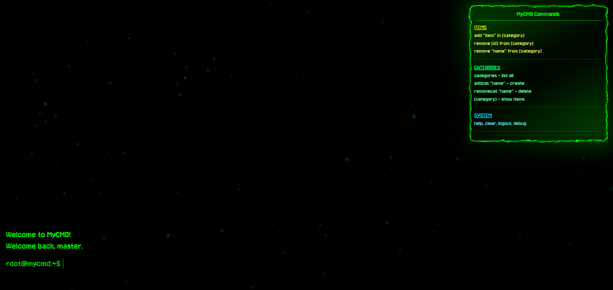
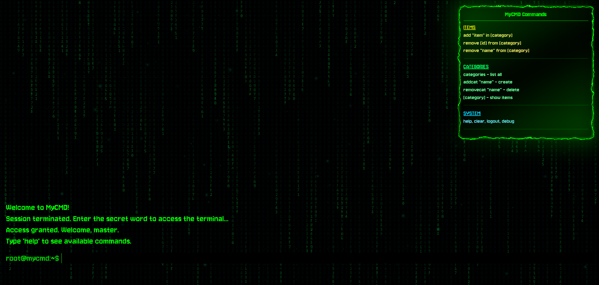

# MyCMD

A sleek, terminal-inspired React application with stunning visual effects including Matrix rain animation, electric borders, and cyberpunk aesthetics. Built with modern React and powered by Vite for lightning-fast development.

## 🎥 Demo

[🎬 Watch Usage Demo](https://drive.google.com/file/d/11CTqgz8ZQ-LfhFVDzgySg4k4MSj5uB5v/view?usp=sharing)

### 📸 Screenshots

<div align="center">
  <div style="display: inline-block; width: 45%; margin: 0 2%;">
    <h4 align="center">Terminal Interface</h4>
    
  </div>
  <div style="display: inline-block; width: 45%; margin: 0 2%;">
    <h4 align="center">Matrix Background Effect</h4>
    
  </div>
</div>

## 🚀 Features

- **Interactive Terminal Interface**: Command-line style interface with authentication system
- **Data Management**: Organize and manage categories, items, and aliases with localStorage persistence
- **Alias System**: Create shortcuts for frequently used URLs
- **Export/Import**: Backup and restore your data across different systems
- **Command History**: Navigate through previous commands with arrow keys
- **Matrix Rain Effect**: Cascading digital rain animation in the background
- **Electric Border Animation**: Dynamic glowing border effects
- **Auto-complete**: Smart command suggestions and tab completion
- **Error Handling**: Clear visual feedback for invalid commands and syntax
- **Responsive Design**: Works seamlessly across different screen sizes
- **Cyberpunk Aesthetics**: Dark theme with neon accents and futuristic styling

## 🎮 Usage & Commands

### Authentication
Enter the secret password to access the terminal (default: check the source code).

### Data Management Commands

#### Categories
- `categories` or `cats` - List all categories and item counts
- `addcat "category"` - Create a new category
- `removecat "category"` - Remove an empty category
- `[category-name]` - Display all items in a category

#### Items
- `add "item" in category` - Add an item to a category (auto-detects URLs)
- `remove "item" from category` - Remove item by name
- `remove [number] from category` - Remove item by ID number

#### Aliases (URL Shortcuts)
- `alias "url" as name` - Create a shortcut for a URL
- `aliaslist` - Show all saved aliases
- `removealias name` - Remove an alias
- `[alias-name]` - Open the aliased URL in a new tab

#### Backup & Restore
- `export` - Download all your data as a JSON backup file
- `import` - Upload and restore data from a JSON backup file

### System Commands
- `help` - Display help panel with all commands
- `clear` - Clear the terminal screen
- `logout` - Log out (preserves your data)
- `debug` - Show system information
- `stats` - Display session statistics
- `uptime` - Show session duration
- `grep [term]` - Search through your data
- `gsearch "term"` - Open Google search in new tab
- `quote` - Get a random inspirational quote

### Example Workflow
```bash
# Create categories and add items
root@mycmd:~$ addcat "projects"
root@mycmd:~$ add "https://github.com/user/repo" in projects
root@mycmd:~$ add "My awesome project idea" in projects

# Create shortcuts
root@mycmd:~$ alias "https://github.com" as gh
root@mycmd:~$ gh  # Opens GitHub in new tab

# Backup your data
root@mycmd:~$ export  # Downloads backup file

# Quick web search
root@mycmd:~$ gsearch "kittens"

# View your data
root@mycmd:~$ cats
root@mycmd:~$ projects
```

## 🛠️ Technologies Used

- **React 19.1.1** - Modern React with latest features
- **Vite 7.1.7** - Fast build tool and dev server
- **Tailwind CSS 4.1.13** - Utility-first CSS framework
- **React Compiler** - Enhanced performance with automatic optimization
- **ESLint** - Code linting and quality assurance
- **PostCSS & Autoprefixer** - CSS processing and vendor prefixes

## 📦 Installation

1. **Clone the repository**
   ```bash
   git clone https://github.com/Leander-Antony/MyCMD.git
   cd MyCMD
   ```

2. **Install dependencies**
   ```bash
   npm install
   ```

3. **Start the development server**
   ```bash
   npm run dev
   ```

4. **Open your browser**
   Navigate to `http://localhost:5173` to see the application

## 📝 Scripts

- `npm run dev` - Start development server
- `npm run build` - Build for production
- `npm run preview` - Preview production build
- `npm run lint` - Run ESLint

## 🎨 Customization

### Changing Background Effects
To switch between different background effects, modify `src/components/Terminal.jsx`:

**Switch to Matrix Effect:**
```jsx
{/* <GlowDot /> */}
<MatrixRain />
```

**Switch to Glow Dot Effects:**
```jsx
<GlowDot />
{/* <MatrixRain /> */}
```

### Data Persistence
The application uses localStorage to persist:
- Categories and items
- Aliases and shortcuts
- User preferences
- Session data (command history, statistics)

## 🎨 Components

- **Terminal.jsx** - Main terminal interface with command processing
- **MatrixRain.jsx** - Animated Matrix-style background effect
- **ElectricBorder.jsx** - Glowing border animation component
- **GlowDot.jsx** - Additional visual effects and animations

## � File Structure

```
src/
├── components/          # React components
│   ├── Terminal.jsx    # Main terminal interface
│   ├── MatrixRain.jsx  # Matrix background effect
│   ├── ElectricBorder.jsx  # Border animations
│   └── GlowDot.jsx     # Dot effects
├── modules/            # Command handlers
│   ├── commandHandlers.js  # Utility commands
│   ├── dataManager.js     # Data management
│   └── aliasManager.js    # Alias system
├── services/           # Data services
│   └── localStorageService.js  # localStorage wrapper
├── utils/              # Utility functions
│   └── terminalUtils.js   # Terminal helpers
└── assets/            # Static assets
```


## 👨‍💻 Author

**Leander Antony**
- GitHub: [@Leander-Antony](https://github.com/Leander-Antony)

## 🌟 Acknowledgments

- Matrix effect inspired by the iconic "The Matrix" movie
- Terminal aesthetics inspired by retro computing interfaces
- Built with modern React best practices and performance optimizations
