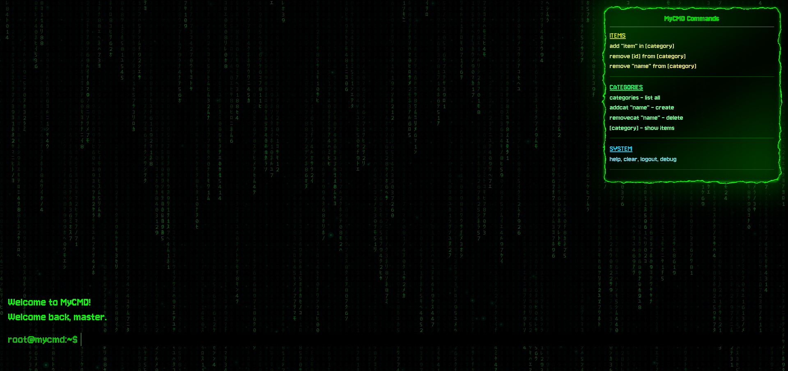

# MyCMD

A sleek, terminal-inspired React application with stunning visual effects including Matrix rain animation, electric borders, and cyberpunk aesthetics. Built with modern React and powered by Vite for lightning-fast development.

### 📸 Screenshots

<div align="center">
  <div style="display: inline-block; width: 45%; margin: 0 2%;">
    <h4 align="center">GlowDot Effects</h4>
    
  </div>
  <div style="display: inline-block; width: 45%; margin: 0 2%;">
    <h4 align="center">Matrix Effect</h4>
    
  </div>
</div>

## 🚀 Features

- **Interactive Terminal Interface**: Command-line style interface with authentication system
- **Matrix Rain Effect**: Cascading digital rain animation in the background
- **Electric Border Animation**: Dynamic glowing border effects
- **Data Management**: Store and manage links, projects, and courses with localStorage persistence
- **Command History**: Navigate through previous commands with arrow keys
- **Responsive Design**: Works seamlessly across different screen sizes
- **Cyberpunk Aesthetics**: Dark theme with neon accents and futuristic styling

## 🛠️ Technologies Used

- **React 19.1.1** - Modern React with latest features
- **Vite 7.1.7** - Fast build tool and dev server
- **Tailwind CSS 4.1.13** - Utility-first CSS framework
- **React Compiler** - Enhanced performance with automatic optimization
- **ESLint** - Code linting and quality assurance
- **PostCSS & Autoprefixer** - CSS processing and vendor prefixes

## 📦 Installation

1. **Clone the repository**
   ```bash
   git clone https://github.com/Leander-Antony/MyCMD.git
   cd MyCMD
   ```

2. **Install dependencies**
   ```bash
   npm install
   ```

3. **Start the development server**
   ```bash
   npm run dev
   ```

4. **Open your browser**
   Navigate to `http://localhost:5173` to see the application

## 🎮 Available Commands

Once the application is running, you can use various terminal commands:

- `help` - Display available commands
- `clear` - Clear the terminal screen
- `links` - Manage your saved links
- `projects` - Manage your projects
- `courses` - Manage your courses
- And many more interactive commands!

## 📝 Scripts

- `npm run dev` - Start development server
- `npm run build` - Build for production
- `npm run preview` - Preview production build
- `npm run lint` - Run ESLint

## 🎨 Components

- **Terminal.jsx** - Main terminal interface with command processing
- **MatrixRain.jsx** - Animated Matrix-style background effect
- **ElectricBorder.jsx** - Glowing border animation component
- **GlowDot.jsx** - Additional visual effects and animations

## 💾 Data Persistence

The application uses localStorage to persist your data including:
- Saved links and bookmarks
- Project information
- Course data
- User preferences

## 🔧 Configuration

The project includes:
- **ESLint configuration** with React-specific rules
- **Vite configuration** optimized for React
- **Tailwind CSS** for utility-first styling
- **PostCSS** for advanced CSS processing


## 👨‍💻 Author

**Leander Antony**
- GitHub: [@Leander-Antony](https://github.com/Leander-Antony)

## 🌟 Acknowledgments

- Matrix effect inspired by the iconic "The Matrix" movie
- Terminal aesthetics inspired by retro computing interfaces
- Built with modern React best practices and performance optimizations
